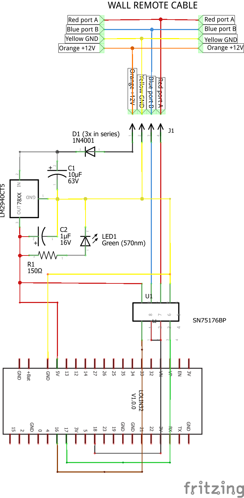
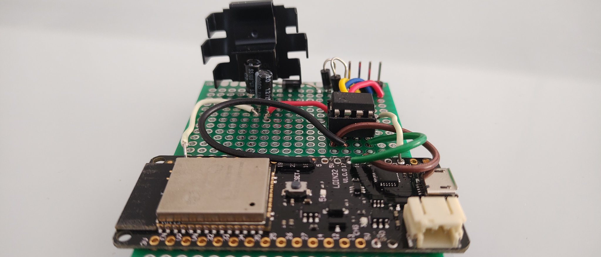

# Briand's SAMSUNG HVAC controller MWR-WH000

Open Source project under GPL3 [LICENSE](LICENSE).

No warranty on circuit or software, do it for educational puroposes. 

#### How to use?

Just edit [Settings](main/Settings.hxx) file entering your own SSID and Password, build circuit and cable and test. 
Always be safe when using electronics and power sources!

## Intro

Samsung MWR-WRH00 with wired remote wall mounted command (D64 type) needs to be wifi-enabled to use with HomeAssistant.

Found protocol on https://github.com/DannyDeGaspari/Samsung-HVAC-buscontrol

2-wire RS485 protocol. To open remote command simply push it up. Will find 4 pin connector (TYPE ????)

```
	male (to remote PCB) (* = attach clip, view from top)

	| | * | |
	| | * | |
	| | * | |
	 | | | |
     1 2 3 4

    female (from wall) (* = attach clip, view from top)

	| | | | |
	| | * | |
	| | * | |
	 1 2 3 4

	1) ORANGE wire, V1, +Vcc 12VDC 
	2) YELLOW wire, V2, GND
	3) RED wire, F3, RS485 port A
	4) BLUE wire, F4, RS485 port B
```

## Voltage adapter (12VDC to 5VDC)

Need to change 12V to 5.1V for ESP32 using zener diode. Circuit:

```
+12V o----| R |------*-------o +5.1V
					 |
					___
					/ \ Zener 5.1V
					 |
					 |
GND  o---------------*-------o GND
```

Calculations, known that ESP32 consumes about 240mA in active mode. Round to 300mA. Zener consumes about 5mA to work.
Voltage across R is Vr, voltage across zener is Vz = 5.1V
	Vr + Vz = 12V => Vr = 12-5.1 = 6.9V
	
R has voltage 6.9V and current is 305mA. So R = V/I = 6.9/0.305 = 22.6ohm so R = 22ohms according to standards. 
R should support 6.9V*0.305A = 2.1W
Zener should support  5.1V*0.305A = 1.55W

Other way: using 7805 regulator, supports up to 1A current.

```	 ________
	|	     |		1) Input, 12V
	| L7805  |		2) GND
	|________|		3) Output, 5V
	 |  |  |
	 |  |  |
	 |  |  |
     1  2  3


+12V o--->|----*---(1) 7805 (3)----*-----o +5V
		D1	   |	   (2)         |
			  ---		|         ---
			  ---C1	    |		  ---C2
			   |	    | 		   |
GND  o---------*--------*----------*-----o GND

```

D1 is 1N4007 (drops 0.6-1V) and helps 7805 work better. C1 is 10uF electrolitic and C2 is 1uF electrolitic (both 25V or C1 25V and C2 10V). Capacitors are **NOT OPTIONAL**.

**NOTE**: Tests shown a high temperature of 7805 reached after a while! Be careful and use a heat sink! Or pass by a 7809 before 7805 so dropped voltage transformed in heat will be less.

## ESP32 Pinout

ESP32 (WeMos Lolin D32) has 3 UARTs (UART0 is monitor, 1 free/unknown, 2 is completely free). IDF Framework based on FreeRTOS allows using an UART hardware port with *any* pin! However RS485 protocol is designed on RTS pin high (RequestToSend) when transmitting, so for this pin a low-level boot time pin is required. Chosen pins are:

GPIO17 as TX pin
GPIO18 as RTS pin
GPIO16 as RX pin

To change pins and port see main.cpp method Briand SamsungHvac->Initialize 
ESP32 will be a sniffer between machine and wired remote in order to be able to use both manual, wall mounted, remote and WiFi. Will need an RS485/TTL 5V converter (can find cheap on Amazon but I suggest to buy a DIP8 SN75176BP, I found that is the best one!).
Setup:

**Cable**

```
		| | | | 
		| | | | 
		| | | | 
		1 2 3 4
		| | | |
		o----------- Orange, V1, +12VDC ---> to 7805 input
		| o--------- Yellow, V2, GND    ---> to 7805 ground
		| | o------- Red, F3, Signal    ---> to A port on RS485/TTL
		| | | o----- Blue, F4, Signal   ---> to B port on RS485/TTL
		| | | |
		1 2 3 4
		| | | | 
 		| | | | 
 		| | | | 
```

## RS485/TTL to ESP32

```
Pin DI/R => to RX (ESP GPIO16)
Pin DE => to RTS  (ESP GPIO18)
Pin RE => to RTS (ESP GPIO18)
Pin RO/D => to TX (ESP GPIO17)

VCC => +5 VDC from 7805
GND => GND
A => cable (red) to A
B => cable (blue) to B
```

## Final circuit

#### Materials needed

* 1x Diode 1N4001 or 1N4007 (or 3x to decrease heat)
* 1x Voltage regulator with output of 5V (7805CV, LM2940CT5 or similar)
* ESP32 
* SN75176BP (best!) or MAX485
* 1x Electrolitic capacitor 10uF 
* 1x Electrolitic capacitor 1uF
* 1x heatsinker for TO-220 voltage regulator

Optional:

* 1x 3mm green Led 
* 1x 150ohm Resistor 
* TVS bipolar diode (RS485 IC input between port A to ground and between port B to ground for ESD/overvoltage protection)

See circuit in Fritzing model (Schema view) or the PNG file.

Calculations:

* LED 3mm green 2V 20mA 5V-2V = 3V and so R = V/I = 3V/0,02 = 150ohm with P = 3V*0,02 = 0,06WW

## Web server commands and API

**Parameters**

* temp : must be integer (ex. 22)
* mode : must be one of: "cool", "fan", "dry", "heat", "auto"
* fan : must be one of: "min", "max", "mid", "auto"
* power : must be "on" or "off"

**Get current HVAC status**

http://<IP>:<PORT>/

returns the current status in JSON

Response:

```
{ "power": "off", "mode": "cool", "temp": 24, "fan": "max", "ha_status": "OK", "ha_active": true }
```

**Change HVAC status**

http://<IP>:<PORT>/SetStatus?temp=<int>&mode=<mode>&fan=<fan>&power=<power>


Sample request/response:

```
http://<IP>:<PORT>/SetStatus?mode=cool&power=on
Power changed to ON
Mode changed to COOL
```

**Restart/reboot**

http://<IP>:<PORT>/RestartEsp

**Monitor log**

http://<IP>:<PORT>/Log

*not implemented yet*

## Test result

All commands are received/sent successfully. However sometimes an error E607 appears on the wall mounted remote when a command is sent and sometimes is not correctly applied.
Possible solutions:

* Setting RX buffer to 0 so no buffering will be made? *No, not allowed!*
* Adding 50ms delay before sending the message through serial when the "mark" is reached qould help? *Did not resolve*
* Play with rx threshold values? *Did not resolve*

On circuit L7805CV model seems to have lot of heat. Needs a heat sink. However another (and implemented solution) is to add 2 more 2N4001 in series to D1 in order to have a lower voltage in input. This solves the heat problem. 

Other unsuccessful test done was adding a 2-step LDO: L7809 before L7805 however this seems to led insufficient amperes to ESP32 meaning no working system at all.

## Protocol

RS485 Protocol description **CREDITS: https://github.com/DannyDeGaspari/Samsung-HVAC-buscontrol**. Took and reported there some needed texts.

*Serial communication settings used on the bus are 2400 baud, 8E1 **(8 bit, even parity, 1 bit stop)**. The wired remote control is the master, the indoor units are the slaves. The wired remote control send commands as a message of 14 bytes. The units respond with a similar message with the same length. The protocol can be described as follows:*

<start> <src> <dst> <cmd> <data: 8 bytes> <chksum> <end>

With:
Byte   Identifier   Comments
----------------------------
1      Start  : start of message (0x32)
2      Src    : Source address
3      Dst    : Destination address
4      Cmd    : Command byte
5-12   Data   : Data is always 8 bytes in length, unused bytes will be zero
13     Chksum : Checksum of message which is the XOR of bytes 2-12
14     End    : end of message (0x34)

*In my case the address of the wired remote control is 0x84* => **For me too!**
*the address of my 2 indoor units are 0x20 and 0x21* => **For me too! However I have just one, 0x20**

An example communication can look like this (all values are hex and xx represent any value):

```
Command:
32 84 20 53 xx xx xx xx xx xx xx xx xx 34
Reply:
32 20 84 53 xx xx xx xx xx xx xx xx xx 34
```

### Command tables

All values of the commands and bit group values in the following tables are in hexadecimal notation.
The bits that are not described in the following tables are zero and the function of those bits are unknown.

### Command A0

Change settings command, by exception the unit replies with command 50, all other commands are replied with the same command identifier.
This is the command to be used when the settings of the HVAC unit needs to be changed.

| Data byte | Settings |
| :---: | :--- |
| 1 | <p>bit 4-0 : 0x1a = blade swing up/down<br>0x1f = blade swing off</p> |
|   | bit 5 : sleep |
| 2 | 0 |
| 3 | bit 4-0 : temperature setting |
|   | <p>bit 7-5 : fan speed<br>0 = auto<br>2 = low<br>4 = medium<br>5 = high</p> |
| 4 | <p>bit 2-0 : mode<br>0 = auto<br>1 = cool<br>2 = dry<br>3 = fan<br>4 = heat</p> |
|   | bit 5 : reset "clean filter" message |
| 5 | <p>bit 7-0 : on/off<br>c4 = switch off<br>f4 = switch on</p> |
| 6 | 0 |
| 7 | <p>bit 3-0 : set blade position<br>0 = closed<br>1 = open smallest<br>2 = mid positions<br>7 = open max</p> |
|   | bit 4 : set blade position |
|   | bit 5 : quiet mode |
| 8 | 0 |

### Command 52

This command is an information request. The bytes in the command are all zeroes, the reply to this command is described below:

| Data byte | Settings |
| :---: | :--- |
| 1 | bit 5-0 : set temperature - 9 |
|   | bit 6   : always set to '1' ? |
| 2 | bit 5-0 : room temperature - 9 |
|   | bit 6   : always set to '1' ? |
| 3 | bit 5-0 : output air temperature - 9 |
|   | bit 6   : always set to '1' ? |
| 4 | <p>bit 2-0 : fan speed<br>0 = auto<br>2 = low<br>4 = medium<br>5 = high</p> |
|   | <p>bit 7-3 : blade swing<br>1A = swing up/down<br>1F = blade swing off</p> |
| 5 | <p>bit 3-0 : 1 = wired control<br>2 = remote control</p> |
|   | bit 4 : 1 = defrost on |
|   | <p>bit 7 : 0 = power is off<br>1 = power in on</p> |
| 6 | bit 4 : 1 = filter needs cleaning |
| 7 | 0 |
| 8 | bit 5-0 : another temperature - 9 |
|   | bit 6   : always set to '1' ? |

### Command 53

This command is an information request. The bytes in the command are all zeroes, the reply to this command is described below:

| Data byte | Settings |
| :---: | :--- |
| 1 | 0 |
| 2 | 0 |
| 3 | 0 |
| 4 | 0 |
| 5 | <p>bit 7-0 : 0 = blade swing off<br>1A = blade swing up/down</p> |
| 6 | 0 |
| 7 | 0 |
| 8 | <p>bit 2-0 : mode<br>0 = auto<br>1 = cool<br>2 = dry<br>3 = fan<br>4 = heat</p> |

### Command 54

This command is an information request. The bytes in the command are all zeroes, the reply to this command is described below:

| Data byte | Settings |
| :---: | :--- |
| 1 | contains value 21, meaning unknown |
| 2 | <p>bit 3-0 : blade position when swing is off<br>0 = closed<br>1 = open smallest<br>2 = mid positions<br>7 = open max</p> |
|   | <p>bit 4 : 0 = blade swing off<br>1 = blade swing up/down</p> |
| 3 | 1E : meaning unknown |
| 4 | 0 |
| 5 | 0 |
| 6 | unknown |
| 7 | 0 |
| 8 | 0 |

### Command 64

This command is the temperature information command to the unit, the reply to this command is described below:

| Data byte | Settings |
| :---: | :--- |
| 1 | contains value 20 for command and reply, meaning unknown |
| 2 | <p> command and reply: bit 0: used temperature for regulation<br>0 = use internal temperature<br>1= use wired remote temperature</p> |
| 3 | command: wired remote temperature value high byte |
|   | reply: used temperature value high byte |
| 4 | command: wired remote temperature value low byte |
|   | reply: used temperature value low byte |
| 5 | reply: unit temperature value high byte |
| 6 | reply: unit temperature value low byte |
| 7 | 0 |
| 8 | 0 |

The temperature in degrees is calculated as follows: 
```
(<high byte> * 256 + <low byte> - 553) / 10
```

### Other commands

Other commands seen on the link are: 63, 70, 71, 83, D1.
The meaning of these commands and replies are unknown.
Be careful with trying other commands because it is possible that there exist commands that have impact on the flash memory contents of the unit and may brick the memory contents of the unit.

## Circuit schema and picture

Circuit schematics



The first working prototype




